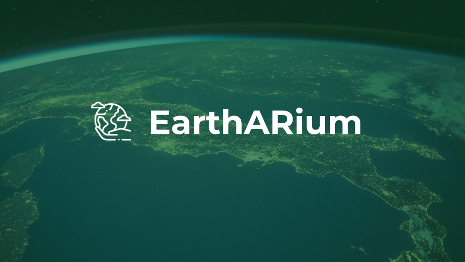

# EarthARium

## Markers

Currenly the markers we are making use of for this project is the following

You can find copies of these for printing in:

* [img/earth-asteroid-collisions.png](img/earth-asteroid-collisions.png)
* [img/earth-asteroid-designer.png](img/earth-asteroid-designer.png)

## Dependencies

### Unity3DGlobe

We make use of a version of [Dandarawy's Unity3D-Globe](https://github.com/Dandarawy/Unity3D-Globe). This needs to be installed in the the `SupergiantScuti/Assets/External` folder. [Use the version found at our fork](https://github.com/t04glovern/Unity3D-Globe), or import the package by using the version we've packaged up:

[https://github.com/t04glovern/Unity3D-Globe/releases/download/1.0/Unity3DGlobe_v1.0.unitypackage](https://github.com/t04glovern/Unity3D-Globe/releases/download/1.0/Unity3DGlobe_v1.0.unitypackage)

Import these dependencies into `SupergiantScuti/Assets/External`

### TextMesh Pro

This asset is now bundled with Unity3D by default. You will still need to import it to your project though.

## Builds

Build Target is setup for Android. If you have the ADB tools installed it should work fine; however check Unity preferences and fill in the Java SDK / ADB details if you have issues

## Sample Worksheet

You can find a sample worksheet in the file [WorksheetAstroid.pdf](WorksheetAstroid.pdf)
